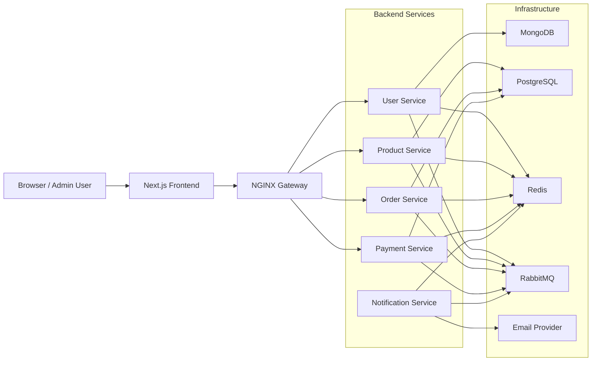

# Scalable E-Commerce Platform

A hands-on full-stack e-commerce project built around a microservices-style backend and a modern Next.js frontend. The goal is to practice real-world distributed system concepts such as service separation, async messaging, per-service data ownership, API gateway routing, and event-driven workflows.

This repository is structured as a backend monorepo with independent services and a separate frontend application. The backend is designed to be modular and containerized, while the frontend provides a storefront and admin experience for interacting with the platform.

---

## Table of Contents

- [Project Overview](#project-overview)
- [Architecture](#architecture)
- [Tech Stack](#tech-stack)
- [Backend Services](#backend-services)
- [Frontend](#frontend)
- [Project Structure](#project-structure)
- [Getting Started](#getting-started)
- [Environment Variables](#environment-variables)
- [Running the Application](#running-the-application)
- [Roadmap](#roadmap)

---

## Project Overview

The platform is split into multiple backend services that communicate through:

- REST APIs through an NGINX gateway
- RabbitMQ for asynchronous event-driven communication
- Redis for cache and transient state
- Separate databases per service to reflect service ownership

This is not a monolithic application. Each service is intended to evolve independently, which is a core part of the design.

---

## Architecture



### Architectural Principles

- Each service owns its own data model and storage
- Cross-service communication is mostly event-driven
- The gateway centralizes entry points and routing
- Infrastructure is containerized using Docker Compose
- Shared internal utilities are kept in a common workspace package

---

## Tech Stack

### Backend

- Node.js
- Express.js
- pnpm workspaces
- Docker + Docker Compose
- MongoDB + Mongoose
- PostgreSQL + Prisma
- Redis
- RabbitMQ
- Stripe
- SendGrid / Nodemailer / Twilio

### Frontend

- Next.js 16
- React 19
- Tailwind CSS
- shadcn/ui
- Radix UI primitives
- next-themes
- Auth0
- Redux Toolkit

---

## Backend Services

### 1. User Service

Path: `Backend/apps/user-service`

Responsibilities:
- User registration and authentication
- JWT-based auth flow
- MongoDB persistence
- Publishing user lifecycle events to RabbitMQ

Main technologies:
- Express
- Mongoose
- bcryptjs
- jsonwebtoken

### 2. Product Service

Path: `Backend/apps/product-service`

Responsibilities:
- Product catalog management
- Product CRUD operations
- PostgreSQL persistence via Prisma
- Publishing product events
- Consuming order-related events for inventory coordination

### 3. Order Service

Path: `Backend/apps/order-service`

Responsibilities:
- Order placement and lifecycle management
- Order status updates
- PostgreSQL persistence via Prisma
- Publishing order events
- Consuming payment events to update order state

### 4. Payment Service

Path: `Backend/apps/payment-service`

Responsibilities:
- Payment creation and status handling
- Stripe integration
- PostgreSQL persistence via Prisma
- Publishing payment events
- Consuming order events to trigger payment flow

### 5. Notification Service

Path: `Backend/apps/notification-service`

Responsibilities:
- Consumer-only service for event-driven notifications
- Sends emails/SMS based on events from RabbitMQ
- Uses SendGrid, Nodemailer, and Twilio-style delivery paths

### 6. API Gateway

Path: `Backend/apps/gateway`

Responsibilities:
- Routes incoming requests to backend services
- Applies rate limiting and request headers
- Exposes a health endpoint
- Centralizes access for the platform

### 7. Shared Package

Path: `Backend/packages/shared`

Responsibilities:
- Centralizes shared message queue utilities
- Stores RabbitMQ queue/event constants
- Prevents duplicated queue logic across services

---

## Frontend

Path: `frontend/`

The frontend is a Next.js application that currently provides:
- a storefront experience
- an admin-oriented product management experience
- theming support and UI components built with Tailwind and shadcn/ui
- API communication to the backend gateway

The frontend is not a separate backend; it acts as the presentation layer for the microservices platform.

---

## Project Structure

```text
Scalable_E_Commerce_Platform/
├── Backend/
│   ├── apps/
│   │   ├── gateway/
│   │   ├── user-service/
│   │   ├── product-service/
│   │   ├── order-service/
│   │   ├── payment-service/
│   │   └── notification-service/
│   ├── packages/
│   │   └── shared/
│   ├── scripts/
│   ├── docker-compose.yml
│   ├── pnpm-workspace.yaml
│   └── package.json
├── frontend/
├── architecture.mmd
└── README.md
```

---

## Getting Started

### Prerequisites

- Node.js
- pnpm
- Docker and Docker Compose

### 1. Clone the repository

```bash
git clone <your-repo-url>
cd Scalable_E_Commerce_Platform
```

### 2. Install backend dependencies

```bash
cd Backend
pnpm install
```

### 3. Install frontend dependencies

```bash
cd ../frontend
npm install
```

---

## Environment Variables

The backend services rely on environment variables for their database and messaging configuration. Typical variables include:

- `PORT`
- `MONGO_URL` or equivalent Mongo connection string
- `DATABASE_URL`
- `JWT_SECRET`
- `REDIS_URL`
- `RABBITMQ_URL`
- `STRIPE_SECRET_KEY`
- `SENDGRID_API_KEY`

These values should be supplied through the local environment or Docker Compose configuration.

---

## Running the Application

### Start infrastructure

```bash
cd Backend
pnpm run dev:infra
```

### Start all backend containers

```bash
cd Backend
pnpm run dev
```

### View logs

```bash
cd Backend
pnpm run logs
```

### Stop containers

```bash
cd Backend
pnpm run down
```

### Start the frontend

```bash
cd frontend
npm run dev
```

---

## Current Status

This repository is actively being developed and includes:

- a containerized microservices backend
- RabbitMQ-based event flow
- gateway-based routing
- product, order, payment, user, and notification services
- a Next.js frontend with admin and store-facing UI pieces

Some areas are still being expanded or refined, especially around full production hardening and the completion of additional flows.

---

## Roadmap

Planned or ongoing improvements include:

- completing the full storefront and checkout flow
- strengthening authentication on admin routes
- expanding inventory handling and order lifecycle automation
- improving observability and logging
- adding stronger CI/CD and deployment workflows
- completing cart and additional commerce features

---

## Notes

The repository also includes an architecture diagram source file at `architecture.mmd`, which can be used with Mermaid-compatible tools to visualize the system layout.
